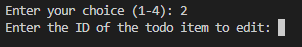

# A2SV To-do List (TypeScript)

A small TypeScript example project that demonstrates a minimal in-memory todo list (create, edit, delete, display). The repository contains a sample implementation at "src/todo.ts".

## Files

- `src/todo.ts` - sample Todo list implementation in TypeScript.
- `dist/todo.js` - todo list implementation compiled to JavaScript.
- `tsconfig.json` - TypeScript configuration (project root).

## How to Run

```bash
node dist/todo.js
```





# A2SV_To-do_List_Typescript
